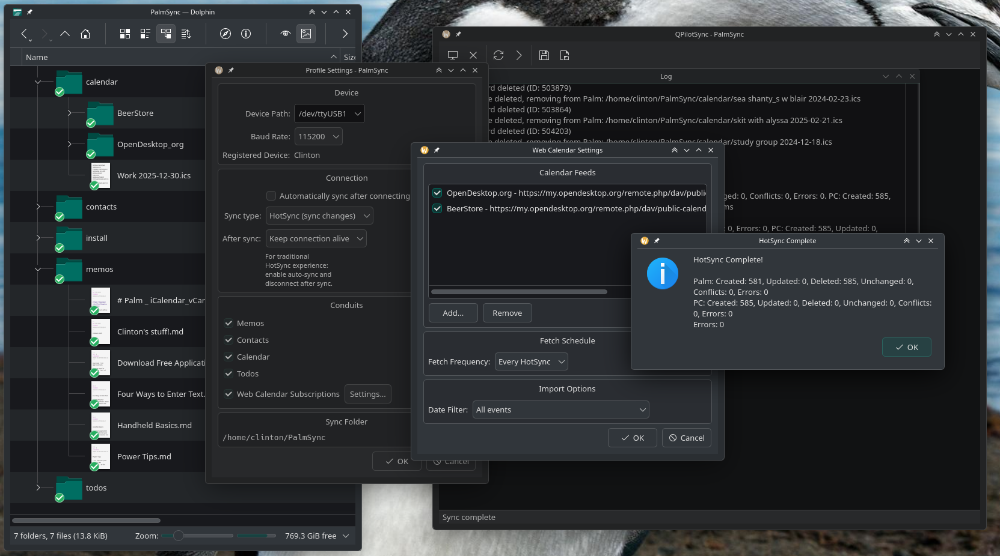

# QPilotSync

Modern Palm Pilot synchronization for Linux using Qt6 and KDE Frameworks 6.



## About

QPilotSync brings classic Palm Pilot devices into the 2020s with support for modern data formats and contemporary desktop environments. Sync your Palm calendar to iCalendar files, contacts to vCards, memos to Markdown, and todos to iCalendar VTODO format - all with a clean Qt6 interface.

This project is a spiritual successor to KPilot, rewritten from scratch with modern C++20 and Qt6.

It has been developed with *extremely close and meticulous human scrutiny* in Claude Code, and is released under GPLv3 to maximize ethical code practices. No data safety is guaranteed, use at your own risk.

Read-only fetching of web calendars is implemented for instant one-way sync with your current cloud-based calendar service, or a tool like [VDirSyncer](https://github.com/pimutils/vdirsyncer) can be used *right now* for bi-directional sync. Esoteric and complex event recurrence rules are still discarded.

Better, integrated calendar handling and syncing is planned.

## Features

### Device Communication
- USB and serial connection support
- Async/non-blocking connection handling
- Device information display (Palm OS version, memory, user info)
- Connection keep-alive for multiple operations without re-sync

### Data Synchronization
- **Calendar** - Bidirectional sync with iCalendar (.ics) files
- **Contacts** - Bidirectional sync with vCard 4.0 (.vcf) files
- **Memos** - Bidirectional sync with Markdown (.md) files
- **Todos** - Bidirectional sync with iCalendar VTODO format

### Web Calendar Subscriptions
- Subscribe to remote iCalendar feeds (read-only)
- Multiple feed support with individual categories
- Configurable fetch intervals (every sync, daily, weekly, monthly)
- Date filtering options (all events, recurring + future, future only)

### Sync Engine
- Extensible conduit plugin architecture
- Dependency-aware conduit ordering
- First-sync detection with device fingerprinting
- Per-profile settings and sync state

### Data Format Support
- Windows-1252 encoding (Palm's native character set)
- Category mapping between Palm and modern formats
- RFC 5545 compliant iCalendar output
- RFC 6350 compliant vCard 4.0 output

## Build Requirements

- **Qt 6.2** or later
- **KDE Frameworks 6** (KCalendarCore)
- **CMake** 3.19+
- **C++20** compatible compiler (GCC 10+, Clang 10+)
- **pilot-link** library and headers
- **libusb** development files

### Installing Dependencies

#### Arch Linux / Manjaro

```bash
# Install from official repos
sudo pacman -S base-devel cmake qt6-base kf6-kcalendarcore libusb libbluetooth

# Install pilot-link from AUR
yay -S pilot-link-git
# or: paru -S pilot-link-git
```

#### Debian / Ubuntu

```bash
# Install build dependencies
sudo apt install build-essential cmake qt6-base-dev \
    libkf6calendarcore-dev libusb-dev libbluetooth-dev

# pilot-link and its related libraries are not in modern Debian/Ubuntu repos
# Download .deb packages from: https://www.jpilot.org/download/
```

#### Fedora

```bash
sudo dnf install @development-tools cmake qt6-qtbase-devel \
    kf6-kcalendarcore-devel libusb-devel bluez-libs-devel pilot-link-devel
```

### Building pilot-link from Source (if packages unavailable)

If pilot-link packages are not available for your distribution, you can build from source:

```bash
git clone https://github.com/jichu4n/pilot-link.git
cd pilot-link
./autogen.sh
./configure --prefix=/usr/local
make -j$(nproc)
sudo make install
sudo ldconfig
```

## Building QPilotSync

```bash
git clone https://github.com/YOUR_USERNAME/QPilotSync.git
cd QPilotSync
mkdir build && cd build
cmake ..
make -j$(nproc)
```

### Running

```bash
./build/qpilotsync
```

## Palm Device Setup

### USB Device Permissions

In Manjaro (and so, likely Arch), I have had to add my user to the `uucp` group in order to get establish a USB connection.

Another trick is to make a udev rule to allow non-root access to Palm devices:

```bash
sudo tee /etc/udev/rules.d/60-palm.rules << 'EOF'
# Palm/Handspring devices
SUBSYSTEM=="usb", ATTR{idVendor}=="0830", MODE="0666"
# Sony CLIE
SUBSYSTEM=="usb", ATTR{idVendor}=="054c", ATTR{idProduct}=="00da", MODE="0666"
EOF

sudo udevadm control --reload-rules
sudo udevadm trigger
```

### Initiating a Sync

1. Launch QPilotSync, create a new profile, and configure your sync folder
2. Select your device path (usually `/dev/ttyUSB0` or `/dev/ttyUSB1`) in profile.
3. Both click "Connect" in QPilotSync and the HotSync button on your Palm cradle within a few seconds. 

### Supported Devices

QPilotSync works with any device supported by pilot-link:

- **Palm OS 3.x** - Palm III, V, Vx, VII, etc.
- **Palm OS 4.x** - m100, m500, m505, m515, etc.
- **Palm OS 5.x** - Tungsten series, Zire series, LifeDrive, TX
- **Handspring** - Visor, Treo 90/180/270/300/600/650
- **Sony CLIE** - All models
- **Other** - Any Palm OS compatible device

Both USB and serial (RS-232) connections are supported.

Windows and Mac support are unlikely in the near future—the underlying libraries are *nix only.

## Documentation

Detailed documentation is available in the `docs/` directory. Beware that these files may not necessarily be up to date:

| Document | Description |
|----------|-------------|
| [PROJECT_VISION.md](docs/PROJECT_VISION.md) | Project goals and philosophy |
| [ARCHITECTURE_2026.md](docs/ARCHITECTURE_2026.md) | Current technical architecture |
| [SYNC_ENGINE_ARCHITECTURE.md](docs/SYNC_ENGINE_ARCHITECTURE.md) | Sync engine design |
| [CONDUIT_PLUGIN_DESIGN.md](docs/CONDUIT_PLUGIN_DESIGN.md) | Conduit plugin system |
| [DATA_LOSS_HANDLING.md](docs/DATA_LOSS_HANDLING.md) | Data loss prevention |
| [FIELD_MAPPING.md](docs/FIELD_MAPPING.md) | Palm to iCalendar/vCard mapping |
| [KPILOT_ANALYSIS.md](docs/KPILOT_ANALYSIS.md) | Analysis of original KPilot |
| [ROADMAP.md](docs/ROADMAP.md) | Development roadmap |
| [CHALLENGES.md](docs/CHALLENGES.md) | Known challenges |
| [GETTING_STARTED.md](docs/GETTING_STARTED.md) | Development setup |

## Project Structure

```
QPilotSync/
├── CMakeLists.txt           # Main build configuration
├── src/
│   ├── main.cpp             # Application entry point
│   ├── app/                  # Main window and UI
│   ├── palm/                 # Palm device communication (pilot-link wrapper)
│   ├── sync/                 # Sync engine and conduits
│   │   ├── conduits/        # Data type handlers (calendar, contacts, etc.)
│   │   ├── syncengine.*     # Core sync orchestration
│   │   └── localfilebackend.* # File-based storage
│   └── profile.*            # User profile management
├── lib/
│   └── CMakeLists.txt       # External dependency configuration
├── docs/                     # Architecture and design docs
├── scripts/                  # Build helper scripts
└── tests/                    # Test suites
```

## Configuration

QPilotSync stores configuration in `~/.config/QPilotSync/` and per-profile settings in a `.qpilotsync.conf` file within each sync folder.

### Sync Folder Structure

```
~/PalmSync/                  # Your sync folder
├── .qpilotsync.conf         # Profile settings
├── .state/                  # Sync state database
├── calendar/                # iCalendar events (.ics)
│   └── Work_Calendar/       # Web calendar subscription
├── contacts/                # vCard files (.vcf)
├── memos/                   # Markdown files (.md)
├── todos/                   # iCalendar todos (.ics)
└── install/                 # .prc/.pdb files to install
    └── installed/           # Already installed files
```

## Contributing

Contributions will be welcome as the project matures; this early release is still fluctuating and total refactors are likely as complex calendar sync logic is intergrated. Areas where help is especially appreciated:

- Testing with various Palm devices and Palm OS versions
- Bug reports and feature requests
- Documentation improvements
- Icons and Graphics
- *Packaging for various Linux distributions* Someone running Debian or Ubuntu might please build a `.deb` file, etc.
- A better name or branding!

## License

GPL-3.0-or-later (compatible with pilot-link and the original KPilot)

## Credits

QPilotSync builds on the work of many projects:

- **[pilot-link](https://github.com/jichu4n/pilot-link)** - The essential Palm communication library
- **KPilot** - The original KDE Palm sync application (inspiration and reference)
- **KDE Frameworks** - KCalendarCore for iCalendar/vCard handling
- **Qt Project** - The excellent Qt6 framework

## Related Projects

- **[J-Pilot](http://www.jpilot.org/)** - GTK-based Palm desktop and sync application
- **[pilot-link](https://github.com/jichu4n/pilot-link)** - Command-line Palm tools

---

*Keeping Palm OS devices alive in the modern era.*
