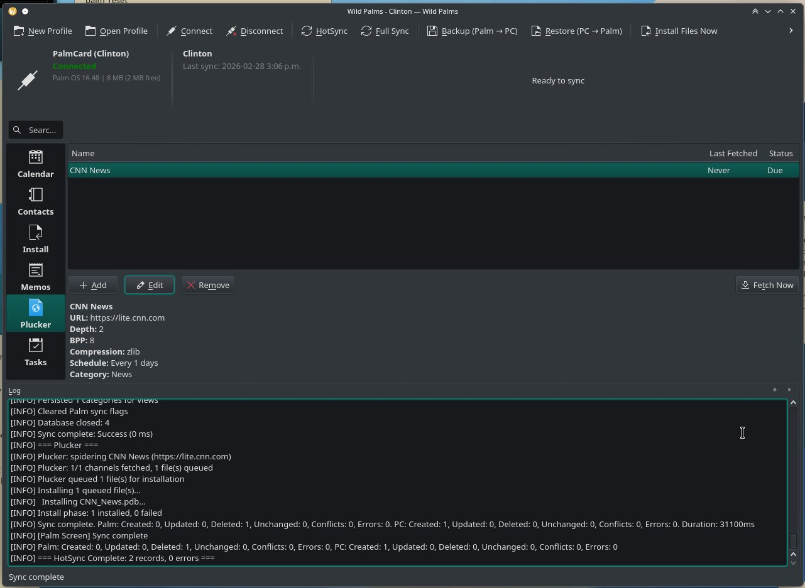

# Wild Palms

Modern Palm OS synchronization for Linux, built with Qt6, KDE Frameworks 6, and an extensible conduit plugin system.

**Wild Palms** is a ground-up rewrite inspired by the original KPilot. It brings Palm devices into the modern Linux desktop with bidirectional sync to open file formats, automatic device detection, a rich plugin architecture for third-party conduits, and native KDE integration.

Be sure to check the [USB Permissions](#usb-device-permissions) section below for help getting set up!



## Why "Wild Palms"?

The project was originally called QPilotSync, but needed its own identity. The name comes from Bruce Wagner's graphic novel *Wild Palms* (later adapted into a 1993 ABC miniseries) — a story about technology, media, and reality that feels right at home bridging decades of computing. It's also just a good name for a Palm app.

## About

Wild Palms syncs your Palm calendar to iCalendar files, contacts to vCards, memos to Markdown, and todos to iCalendar VTODO format. Everything lands in a plain folder on your filesystem — no proprietary databases, no lock-in. Use your synced data with any editor, calendar app, or version control system you like.

This project has been developed with *extremely close and meticulous human scrutiny* in Claude Code, and is released under GPLv3 to maximize ethical code practices.

No data safety is guaranteed. Use at your own risk.

## Features at a Glance

### Bidirectional PIM Sync

| Data Type | Palm Database | PC Format | View |
|-----------|--------------|-----------|------|
| Calendar | DatebookDB | iCalendar `.ics` (VEVENT) | Calendar browser |
| Contacts | AddressDB | vCard 4.0 `.vcf` | Contact browser |
| Memos | MemoDB | Markdown `.md` with YAML frontmatter | Memo browser |
| Todos | ToDoDB | iCalendar `.ics` (VTODO) | Task browser/editor |

All four PIM conduits support HotSync (dirty-flag-only, fast), full sync, copy in either direction, backup, and restore. Category names are synced bidirectionally and can be managed from the PC side.

### Web Calendar Subscriptions

Subscribe to remote iCalendar feeds for one-way sync to your Palm:

- Multiple named feeds, each mapped to its own Palm category
- Configurable fetch intervals: every sync, daily, weekly, monthly
- Date filtering: all events, recurring + future, or future only
- Feeds are merged into your calendar sync folder automatically

For full bidirectional cloud calendar sync, pair with a tool like [VDirSyncer](https://github.com/pimutils/vdirsyncer). Better integrated CalDAV handling is planned.

### Plucker: Offline Web Reading on Your Palm

The bundled **Plucker conduit** converts web pages into compressed Palm documents for offline reading — a full-featured web-to-Palm pipeline:

- **Multiple channels** — each with its own home URL, crawl settings, and Palm category
- **Deep spidering** — configurable crawl depth, breadth-first or depth-first, stay-on-host filter, URL inclusion patterns, custom user-agent
- **Image processing** — configurable colour depth, max dimensions (portrait and landscape), compression quality, or disable images entirely
- **Storage targets** — install to RAM, SD card, Memory Stick, or CompactFlash with custom subdirectory paths
- **Scheduling** — per-channel auto-update frequency (hours, days, weeks) with next-due tracking
- **Automatic viewer install** — detects whether the Plucker viewer app is on the device and installs it (plus the SysZLib dependency) if missing
- **Bundled PyPlucker** — the Python spider/converter is included as a submodule; no separate install needed

### File Installation

Drag-and-drop `.prc` and `.pdb` files onto the Install view (or use the file picker) to queue them for installation at next sync. Installed files are moved to an `installed/` archive automatically.

Any conduit can also programmatically queue files for installation via the shared `SyncContext::installQueue` — this is how the Plucker conduit delivers its `.pdb` output to the device.

### Device Connection

- **Automatic USB detection** — `libudev`-based monitoring detects Palm devices the moment they're plugged in and the HotSync button is pressed
- **Multi-port probing** — Palm USB devices expose two serial ports (HotSync + debug console); Wild Palms probes both simultaneously and connects to the correct one
- **Auto-profile resolution** — detected devices are matched to their profile by USB serial number, then user ID, then username
- **Comprehensive device info** — reads model name, manufacturer, Palm OS version, ROM/RAM sizes during handshake; persisted in the profile and displayed in the dashboard
- **Keep-alive mode** — maintains the connection between operations with periodic tickle, so you can browse device info, run multiple syncs, and install files without reconnecting
- **Traditional HotSync mode** — optionally auto-sync and disconnect after each connection, just like the classic Palm Desktop experience

### Sync Engine

- **Six sync modes** — HotSync, Full Sync, Copy Palm to PC, Copy PC to Palm, Backup, Restore
- **Incremental change detection** — dirty-flag tracking on the Palm side, content-hash baselines on the PC side; only changed records are transferred
- **Conflict resolution** — layered system with auto-resolve strategies (palm wins, PC wins, newer wins, duplicate, etc.), interactive conflict dialog, deferred conflict queue with batch review UI
- **Volatility guard** — warns before syncs that would change more than 70% of records, protecting against accidental bulk data loss
- **Data loss tracking** — every sync result carries detailed warnings about truncated fields, unsupported features, or encoding downgrades
- **Dependency ordering** — conduits declare run-before/run-after constraints; Kahn's topological sort ensures correct execution order

### KDE Desktop Integration

- **KXmlGuiWindow** with XMLGUI menus, toolbars, and configurable keyboard shortcuts
- **KPageWidget** icon-sidebar layout (like KDE System Settings) with dynamically loaded conduit pages
- **KStatusNotifierItem** system tray with minimize-to-tray support
- **KDE notifications** for connection events
- **KConfig** global settings at `~/.config/wildpalmsrc`
- **Portable profiles** — each profile is a `.wildpalms.conf` file inside the sync folder itself; move the folder, settings travel with it

---

## Conduit Plugin Architecture

Wild Palms is designed around a plugin system. Every data handler — Memos, Calendar, Contacts, Todos, Plucker, Install, Web Calendar — is a conduit plugin loaded at runtime via the KDE plugin framework.

### What a Third-Party Conduit Can Do

Third-party developers can create conduits that plug into Wild Palms with full access to the same capabilities the built-in conduits use:

| Capability | Description |
|-----------|-------------|
| **Sync data** | Read/write Palm database records, map to any PC file format |
| **Provide a view** | Add a page to the icon sidebar with a full browse/edit widget |
| **Contribute menus** | Merge `KXMLGUIClient` actions into the main window's menus and toolbars |
| **Declare dependencies** | Specify run-before/run-after constraints relative to other conduits |
| **Queue file installs** | Push `.prc`/`.pdb` paths onto the shared install queue |
| **Run external tools** | Invoke subprocesses (like PyPlucker) with timeout management |
| **Access the device** | Use the full pilot-link API: open databases, install files, query device info |
| **Store settings** | Per-profile JSON config blobs, loaded/saved by the profile system |
| **Schedule runs** | Interval-based `shouldRun()` logic to skip unnecessary syncs |
| **Provide config pages** | Add configuration UI to the Profile Properties dialog |

Conduits are standard KDE plugins — a shared library with a JSON metadata file:

```json
{
    "KPlugin": {
        "Name": "My Conduit",
        "Description": "Syncs my custom data",
        "Icon": "my-icon"
    },
    "X-WildPalms-ConduitId": "myconduit",
    "X-WildPalms-ConduitType": "sync",
    "X-WildPalms-PalmDatabase": "MyDB",
    "X-WildPalms-DefaultEnabled": true,
    "X-WildPalms-RunAfter": ["contacts"]
}
```

The Plucker conduit is a good example of what's possible: it runs an external tool, processes the output, queues files for installation, auto-installs a viewer app on the device, provides a full channel management UI with a tabbed configuration dialog, and schedules its own update intervals — all as a plugin.

More conduits are planned, and third-party contributions are welcome. If you have a Palm database that needs syncing, Wild Palms gives you the framework to build it.

---

## Build Requirements

- **Qt 6.2** or later
- **KDE Frameworks 6** (KCalendarCore, KXmlGui, KNotifications, KStatusNotifierItem, etc.)
- **CMake** 3.19+
- **C++20** compatible compiler (GCC 10+, Clang 10+)
- **pilot-link** library and headers
- **libudev** development files
- **Python 3** (for the Plucker conduit's PyPlucker spider)

### Installing Dependencies

#### Arch Linux / Manjaro

```bash
# Install from official repos
sudo pacman -S base-devel cmake qt6-base kf6-kcalendarcore libusb libbluetooth python

# Install pilot-link from AUR
yay -S pilot-link-git
# or: paru -S pilot-link-git
```

#### Debian / Ubuntu

```bash
# Install build dependencies
sudo apt install build-essential cmake qt6-base-dev \
    libkf6calendarcore-dev libusb-dev libbluetooth-dev python3

# pilot-link and its related libraries are not in modern Debian/Ubuntu repos
# Download .deb packages from: https://www.jpilot.org/download/
```

#### Fedora

```bash
sudo dnf install @development-tools cmake qt6-qtbase-devel \
    kf6-kcalendarcore-devel libusb-devel bluez-libs-devel pilot-link-devel python3
```

### Building pilot-link from Source (if packages unavailable)

If pilot-link packages are not available for your distribution, you can build from source:

```bash
git clone https://github.com/jichu4n/pilot-link.git
cd pilot-link
./autogen.sh
./configure --prefix=/usr/local
make -j$(nproc)
sudo make install
sudo ldconfig
```

## Building Wild Palms

```bash
git clone --recurse-submodules https://github.com/nickvonkaenel/WildPalms.git
cd WildPalms
cmake -B build
make -C build -j$(nproc)
```

### Running

```bash
./build/wildpalms
```

## Palm Device Setup

### USB Device Permissions

On Arch/Manjaro, you may need to add your user to the `uucp` group for USB serial access:

```bash
sudo usermod -aG uucp $USER
```

Then restart your session (a logout/login may not be sufficient; a reboot is reliable).

Run `sudo dmesg --follow` in a terminal the first time you press HotSync to identify your device ports. Wild Palms can auto-detect them, but it helps to know what to expect.

You can also create a udev rule for non-root access to Palm devices:

```bash
sudo tee /etc/udev/rules.d/60-palm.rules << 'EOF'
# Palm/Handspring devices
SUBSYSTEM=="usb", ATTR{idVendor}=="0830", MODE="0666"
# Sony CLIE
SUBSYSTEM=="usb", ATTR{idVendor}=="054c", ATTR{idProduct}=="00da", MODE="0666"
EOF

sudo udevadm control --reload-rules
sudo udevadm trigger
```

### Getting Started

1. Launch Wild Palms and create a new profile (File > New Profile), selecting a folder for your synced data
2. Configure your device port in Profile Settings (usually `/dev/ttyUSB0` or `/dev/ttyUSB1`)
3. Click Connect in Wild Palms, then press the HotSync button on your Palm cradle
4. Once connected, choose a sync operation from the Sync menu — or browse your device info, install files, manage Plucker channels, etc.

By default, the connection stays open for multiple operations. For the classic one-button HotSync experience, enable **Auto-sync on connect** and **Disconnect after sync** in Profile Settings.

### Supported Devices

Wild Palms works with any device supported by pilot-link:

- **Palm OS 3.x** — Palm III, V, Vx, VII, etc.
- **Palm OS 4.x** — m100, m500, m505, m515, etc.
- **Palm OS 5.x** — Tungsten series, Zire series, LifeDrive, TX
- **Handspring** — Visor, Treo 90/180/270/300/600/650
- **Sony CLIE** — All models
- **Other** — Any Palm OS compatible device

Both USB and serial (RS-232) connections are supported. Windows and Mac support are unlikely in the near future — the underlying libraries are *nix only.

## Sync Folder Structure

Each profile is a self-contained folder:

```
~/PalmSync/
├── .wildpalms.conf          # Profile settings (portable)
├── .state/                  # Sync state, ID mappings, conflict queue
├── calendar/                # iCalendar events (.ics)
│   └── Work_Calendar/       # Web calendar subscription subfolder
├── contacts/                # vCard files (.vcf)
├── memos/                   # Markdown files (.md)
├── todos/                   # iCalendar todos (.ics)
└── install/                 # .prc/.pdb files queued for installation
    └── installed/           # Archive of already-installed files
```

Global settings live at `~/.config/wildpalmsrc`.

## Documentation

Detailed documentation is available in the `docs/` directory. These files may not always be up to date:

| Document | Description |
|----------|-------------|
| [PROJECT_VISION.md](docs/PROJECT_VISION.md) | Project goals and philosophy |
| [ARCHITECTURE_2026.md](docs/ARCHITECTURE_2026.md) | Current technical architecture |
| [SYNC_ENGINE_ARCHITECTURE.md](docs/SYNC_ENGINE_ARCHITECTURE.md) | Sync engine design |
| [LIBKALBURATOR.md](docs/LIBKALBURATOR.md) | Pointer into the libkalburator integration |
| [DATA_LOSS_HANDLING.md](docs/DATA_LOSS_HANDLING.md) | Data loss prevention |
| [FIELD_MAPPING.md](docs/FIELD_MAPPING.md) | Palm to iCalendar/vCard field mapping |

## Contributing

Contributions are welcome! Areas where help is especially appreciated:

- **Testing** with various Palm devices and Palm OS versions
- **Conduit development** — build a conduit for your favourite Palm database
- **Packaging** for Linux distributions (Debian/Ubuntu `.deb`, Fedora `.rpm`, Flatpak, AppImage)
- **Bug reports** and feature requests
- **Icons and graphics**

## License

GPL-3.0-or-later (compatible with pilot-link and the original KPilot)

## Credits

Wild Palms builds on the work of many projects:

- **[pilot-link](https://github.com/jichu4n/pilot-link)** — The essential Palm communication library
- **KPilot** — The original KDE Palm sync application (inspiration and reference)
- **[Plucker](http://www.plkr.org/)** — The offline web reader for Palm OS, and PyPlucker
- **KDE Frameworks** — KCalendarCore, KXmlGui, KNotifications, and more
- **Qt Project** — The excellent Qt6 framework

## Related Projects

- **[J-Pilot](http://www.jpilot.org/)** — GTK-based Palm desktop and sync application
- **[pilot-link](https://github.com/jichu4n/pilot-link)** — Command-line Palm tools

---

*Keeping Palm OS alive on the modern Linux desktop.*
